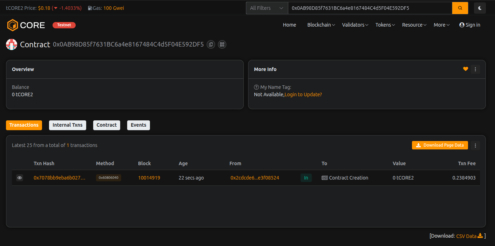

# Bondify Smart Assets

## Project Description

Bondify Smart Assets is a decentralized blockchain platform that revolutionizes bond issuance and management through smart contracts. The platform enables organizations to tokenize traditional bonds, allowing for fractional ownership, automated coupon payments, transparent trading, and simplified bond lifecycle management on the Ethereum blockchain.

By leveraging blockchain technology, Bondify eliminates intermediaries, reduces transaction costs, and provides real-time settlement for bond purchases, transfers, and redemptions. The platform makes bond investments more accessible to retail investors through fractional ownership while maintaining the security and compliance requirements of traditional bond markets.

## Project Vision

Our vision is to democratize access to fixed-income securities by creating a transparent, efficient, and inclusive bond market powered by blockchain technology. We aim to:

- **Democratize Bond Investing**: Enable retail investors to participate in bond markets through fractional ownership and lower minimum investment thresholds
- **Increase Market Efficiency**: Eliminate intermediaries and reduce settlement times from days to seconds
- **Enhance Transparency**: Provide real-time visibility into bond ownership, transactions, and coupon payments
- **Global Accessibility**: Create a borderless bond market accessible 24/7 to investors worldwide
- **Automate Compliance**: Implement smart contract-based compliance and automated coupon distributions

## Key Features

### 1. **Bond Issuance**
- Organizations can issue digital bonds with customizable parameters (face value, coupon rate, maturity date)
- Transparent on-chain record of all bond terms and conditions
- Automated bond lifecycle management

### 2. **Fractional Ownership**
- Purchase individual bond units rather than large denominations
- Lower barriers to entry for retail investors
- Flexible investment amounts

### 3. **Automated Coupon Payments**
- Smart contract-based coupon calculations
- Automatic distribution of interest payments to bondholders
- Annual coupon claim functionality with transparent tracking

### 4. **Seamless Bond Trading**
- Peer-to-peer bond transfers without intermediaries
- Real-time settlement of transactions
- Complete ownership history on-chain

### 5. **Automated Redemption**
- Automatic redemption at maturity
- Instant payment of face value to bondholders
- No manual processing required

### 6. **Transparent Tracking**
- View all bonds owned in a single dashboard
- Real-time balance updates
- Complete transaction history

### 7. **Issuer Controls**
- Bond issuers can manage their issued bonds
- Ability to deactivate bonds when necessary
- Track available supply and bondholder distribution

### 8. **Pending Coupon Calculator**
- Real-time calculation of pending coupon payments
- Transparent accrual tracking
- Clear visibility into expected returns

### 9. **Multi-Bond Portfolio Management**
- Users can hold multiple different bonds
- Portfolio overview functionality
- Diversified fixed-income investments

### 10. **Security & Immutability**
- All transactions recorded immutably on blockchain
- Smart contract-enforced rules and conditions
- Reduced counterparty risk

## Future Scope

### Short-term Enhancements
- **Secondary Market Integration**: Build a decentralized exchange for trading bonds before maturity
- **Price Discovery Mechanism**: Implement dynamic pricing based on market demand and supply
- **Credit Rating Integration**: Partner with rating agencies for on-chain credit assessments
- **Multi-Currency Support**: Enable bond issuance and payments in multiple cryptocurrencies and stablecoins

### Medium-term Developments
- **Regulatory Compliance Module**: Implement KYC/AML verification and accredited investor checks
- **Yield Curve Analytics**: Provide advanced analytics and yield curve visualization tools
- **Collateralized Bonds**: Support for asset-backed and collateralized bond structures
- **Automated Market Making**: Liquidity pools for bond trading with automated price discovery

### Long-term Vision
- **Cross-Chain Interoperability**: Enable bond trading across multiple blockchain networks
- **Institutional Integration**: Connect with traditional financial institutions and settlement systems
- **Derivatives Market**: Introduce bond futures, options, and other derivative products
- **AI-Powered Risk Assessment**: Machine learning models for credit risk evaluation
- **Green Bond Certification**: Specialized features for ESG-compliant and green bonds
- **Governance Token**: Introduce platform governance through a DAO structure
- **Insurance Integration**: Smart contract-based bond insurance products
- **Real-World Asset Tokenization**: Expand beyond bonds to other fixed-income instruments

### Technical Roadmap
- Layer 2 scaling solutions for reduced gas fees
- Enhanced security audits and formal verification
- Mobile application development
- Integration with traditional banking infrastructure
- Advanced portfolio management tools
- Automated tax reporting and compliance

---

## Getting Started

### Prerequisites
- Node.js v14+ and npm
- Hardhat or Truffle for deployment
- MetaMask or compatible Web3 wallet

### Installation
```bash
# Clone the repository
git clone <repository-url>

# Navigate to project directory
cd Bondify-Smart-Assets

# Install dependencies
npm install

# Compile smart contracts
npx hardhat compile

# Run tests
npx hardhat test

# Deploy to network
npx hardhat run scripts/deploy.js --network <network-name>
```

### Smart Contract Functions

1. **issueBond()** - Issue a new bond with specified parameters
2. **purchaseBond()** - Purchase bond units with ETH
3. **claimCoupon()** - Claim annual coupon payments
4. **redeemBond()** - Redeem bonds at maturity
5. **transferBond()** - Transfer bonds to another address
6. **getBondDetails()** - Retrieve bond information
7. **getBondBalance()** - Check bond holdings
8. **calculatePendingCoupon()** - Calculate claimable coupons
9. **getUserBonds()** - Get all bonds owned by address
10. **deactivateBond()** - Issuer can deactivate bonds

---

## License
MIT License

## Contact
For questions and support, please open an issue in the repository.

---

**Bondify Smart Assets** - Building the Future of Fixed-Income Securities on Blockchain

---

## Contract Details:

Transaction id: 0x0AB98D85f7631BC6a4e8167484C4d5F04E592DF5
